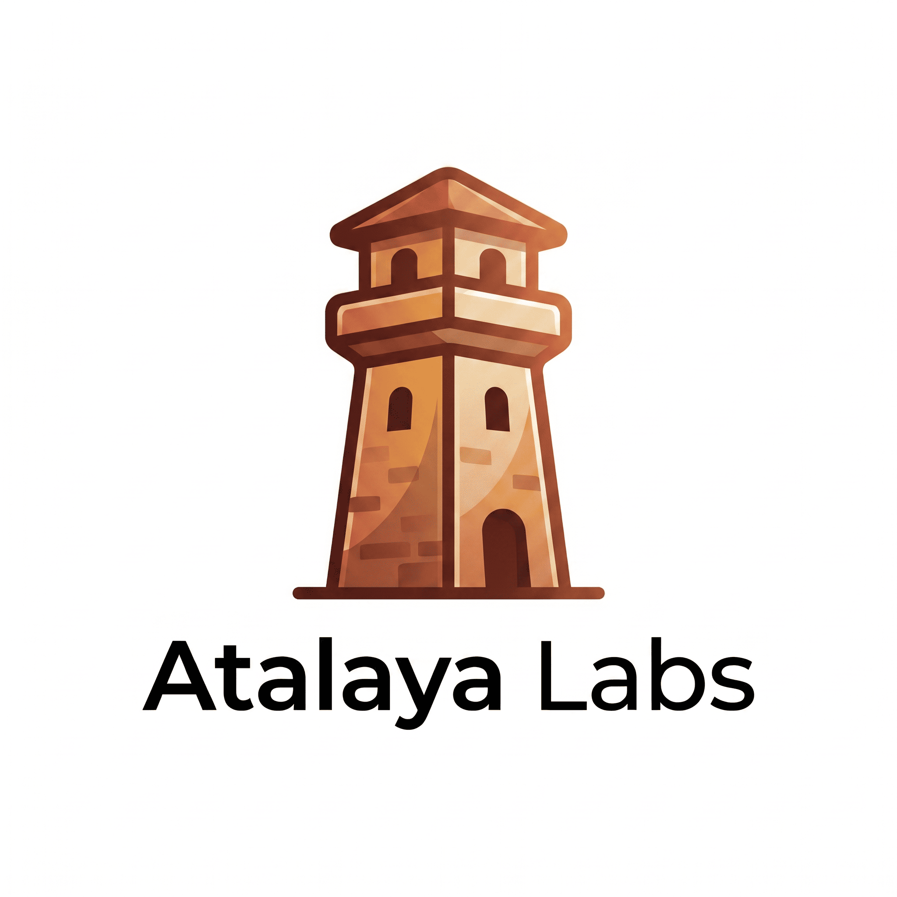

  

  # AtalayaLabs

  **Open-source software for people who want to own their data.**

  Fast, secure and thoughtfully designed tools focused on privacy, performance and self-hosting.

  

    <a href="https://github.com/AtalayaLabs/OxiCloud">OxiCloud</a> •
    <a href="https://github.com/AtalayaLabs/OxiCloud/discussions">Discussions</a> •
    <a href="https://github.com/AtalayaLabs/OxiCloud/issues">Issues</a> •
    <a href="https://github.com/AtalayaLabs/OxiCloud/blob/main/CONTRIBUTING.md">Contributing</a>
  

---

## About

AtalayaLabs builds practical open-source software with a simple idea behind it:

- Your data should stay under your control.
- Infrastructure should feel lightweight, not exhausting.
- Performance should be a feature, not an afterthought.
- Good software should be powerful **and** easy to run.

The focus is on tools that are fast, reliable and pleasant to use, with a strong preference for self-hosting and operational simplicity.

## Featured project

### OxiCloud

**OxiCloud** is a fast, secure and lightweight self-hosted cloud platform built in Rust.

It is designed for people who want a modern way to store, sync and access their files without giving up control of their infrastructure.

**Why it exists:**

- Traditional self-hosted platforms are often too heavy.
- Many users want simpler deployment and lower resource usage.
- Privacy-conscious teams need modern tools without lock-in.

**Start here:**

- Repository: <https://github.com/AtalayaLabs/OxiCloud>
- Discussions: <https://github.com/AtalayaLabs/OxiCloud/discussions>
- Issues: <https://github.com/AtalayaLabs/OxiCloud/issues>

## Build principles

Projects at AtalayaLabs aim to follow a few clear principles:

- **Privacy-first** when handling user data.
- **Rust-first** when it helps safety and performance.
- **Self-hosted by default** for users who value ownership.
- **Operational simplicity** so deployment stays manageable.
- **Thoughtful product design** over unnecessary complexity.
- **Open collaboration** through issues, discussions and contributions.

## Contributing

Contributions are welcome, whether that means code, testing, documentation, feedback or design ideas.

A good way to get involved:

- Star the project and follow development.
- Open an issue if you find a bug.
- Start a discussion for ideas or feature requests.
- Check contribution guidelines before opening larger pull requests.
- Share your setup, benchmarks or deployment experience.

## Useful resources

- Main repository: <https://github.com/AtalayaLabs/OxiCloud>
- Contribution guide: <https://github.com/AtalayaLabs/OxiCloud/blob/main/CONTRIBUTING.md>
- Discussions: <https://github.com/AtalayaLabs/OxiCloud/discussions>
- Issue tracker: <https://github.com/AtalayaLabs/OxiCloud/issues>

## Support

If sponsorship is enabled, this organization may later include a direct support link here.

Support helps fund maintenance, documentation, improvements and long-term sustainability.

---

  Building fast, private and open software.

